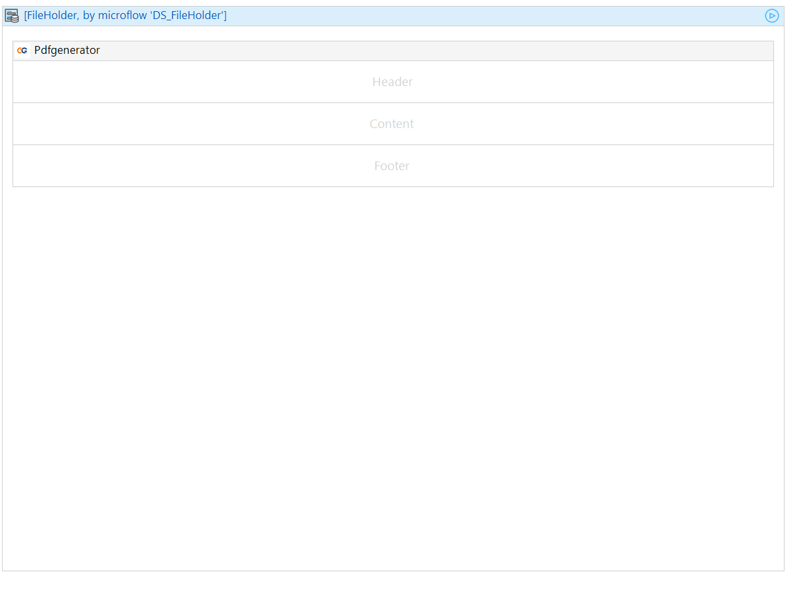

# Setting Up Client-Side PDF Generation

## Overview

The PDF Generator module provides two types of generators for client-side PDF generation:
1. Normal (Recommended for most cases)
2. Legacy (For specific use cases)

This guide focuses on setting up the Normal type, which is suitable for most use cases.

## Comparison with Legacy Type

**Normal Type:**
- Easier to configure
- Suitable for most straightforward PDF generation needs
- Cannot display certain Mendix widgets (e.g., graphs)
- Single page layout per PDF

**Legacy Type:**
- More complex configuration
- Works with graphs
- Allows different page layouts in one PDF
- More flexible but harder to get right

## Important Limitations

Client-side PDF generation has several significant limitations:

1. **Widget Compatibility**: The Normal generator cannot display certain Mendix widgets, such as graphs.
2. **No Batch Processing**: All client-side types cannot perform batch processing or scheduled processing, as they need to run on the client side.
3. **Image-Based PDFs**: All client-side generators create PDFs by first generating images which are then packaged as a PDF. This is a limitation of the underlying library used.

## Setup Process

### 1. Prepare Your Page

- Use the `DS_FileHolder` as the datasource in your page.
- The `FileHolder` entity will contain the PDF result.

### 2. Add the PDF Generator Widget

- Locate the `pdfGenerator` widget in the toolbox.
- Add it to your page.
- Double-click the widget to open its configuration.

### 3. Configure the Widget

#### General Configuration

- **Authorization Key**: Set this to the `FileHolder` entity's AuthorizationKey property.
- **Widget ID**: Assign a unique identifier. This is crucial if you have multiple generators on one page.
- **Caption**: Set the button text for generating the PDF.
- **Button Style**: Choose from standard button style options.
- **Progress Bar Caption**: Set the message shown to users during PDF generation.
- **PDF Holder**: Link to the `FileHolder` entity's `FileString` property. This will store the base64 string of your PDF.

#### Canvas Configuration

- Set the PDF image format.
- Adjust quality settings.
- Set the scale.
- Configure DPI (Dots Per Inch).

#### Paper Configuration

- Choose paper orientation (Landscape or Portrait).
- Select the paper type.

#### Generation Configuration

- Set the generation trigger.
- Define actions to occur after PDF generation.

## Example Snippet

For a practical implementation example, refer to:
`USE_ME/ClientSide/PDFSnippet`

This snippet demonstrates the typical workflow and configuration for normal client-side PDF generation.

## Best Practices

- Ensure unique Widget IDs when using multiple generators on a single page.
- Test different canvas and paper configurations to achieve the desired output quality and format.
- Consider user experience when setting up generation triggers and post-generation actions.
- When designing your PDF layout, be mindful of the limitations regarding certain Mendix widgets, especially graphs.
- If you need to include complex widgets or multiple page layouts, consider using the Legacy type or exploring the server-side generation option.
- Be aware that the image-based nature of client-side PDFs may affect the quality and file size of the generated documents.

## When to Consider Alternatives

Consider using the Legacy client-side generator if:
- You need to include graphs in your PDFs.
- Your PDF requires multiple different page layouts within a single document.
- You're willing to work with a more complex configuration for greater flexibility.

Consider using server-side PDF generation if:
- You need to include complex Mendix widgets like graphs in your PDFs.
- Your use case requires batch processing or scheduled PDF generation.
- You need higher quality PDFs that are not based on images.
- You're generating large numbers of PDFs and want to offload the processing from the client.

