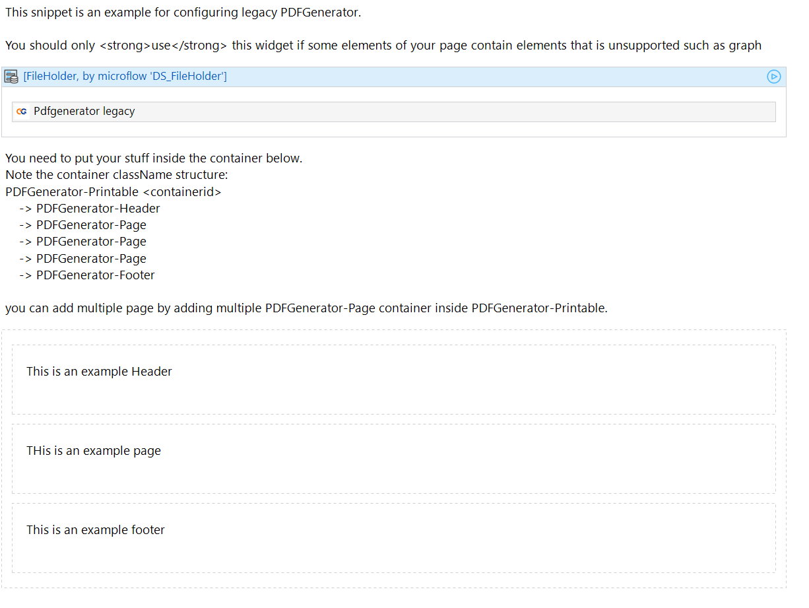
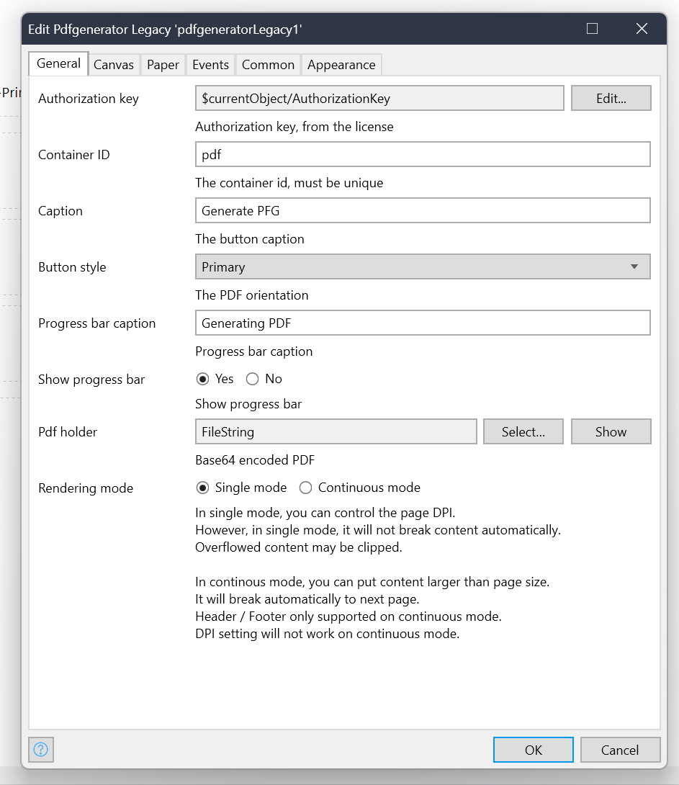

# Setting Up Legacy Client-Side PDF Generator

## Overview

The Legacy PDF Generator uses a different approach compared to the Normal type. Key features include:
- Works with graphs
- Allows different page layouts in one PDF
- More complex configuration

## Advantages and Disadvantages

**Advantages:**
- Compatible with graphs
- Flexible page layouts within a single PDF

**Disadvantage:**
- More difficult to configure and get right

## Setup Process

### 1. Prepare Your Page

- Ensure the context has a FileHolder entity.
- You can use `DS_FileHolder` to initialize it.

### 2. Add the Widget

- Add the `Pdfgenerator legacy` widget to your page.

### 3. Structure Your Containers


Follow this container structure:

```
PDFGenerator-Printable <containerid>
    -> PDFGenerator-Header
    -> PDFGenerator-Page
    -> PDFGenerator-Page
    -> PDFGenerator-Page
    -> PDFGenerator-Footer
```

- You can add multiple pages by including multiple `PDFGenerator-Page` containers inside `PDFGenerator-Printable`.
- Place your content inside these containers.

### 4. Configure the Widget



#### General Configuration
- **Authorization Key**: Use `AuthorizationKey` property from the FileHolder entity
- **Container ID**: Must be unique (like the normal type)
- **Caption**: Set the PDF Generator button caption
- **Button Style**: Choose the PDF Generator button style
- **Progress Bar Caption**: Same as normal type
- **Show Progress Bar**: Same as normal type
- **PDF Holder**: Same as normal type

#### Rendering Mode
Choose between:
- **Single Mode**: 
  - Control DPI
  - No content break due to library limitations
  - Does not support page header/footer
- **Continuous Mode**:
  - Can handle content larger than page size
  - Automatically breaks content to next page

#### Canvas Configuration
Same configuration options as the normal type

#### Paper Configuration
Same configuration options as the normal type

#### Events Configuration
Same configuration options as the normal type

## Example Snippet

For a practical implementation example, refer to:
`USE_ME/ClientSide/PDFSnippet_Legacy`

This snippet demonstrates the typical workflow and configuration for the legacy client-side PDF generation.

## Best Practices

- Carefully plan your container structure to achieve the desired layout.
- Test thoroughly, especially when using multiple page layouts or including graphs.
- Consider the trade-off between flexibility and ease of configuration when choosing between legacy and normal types.

## When to Use Legacy Generator

Consider using the legacy generator when:
- You need to include graphs in your PDFs
- Your PDF requires multiple different page layouts
- The normal generator's limitations are preventing you from achieving your desired output

