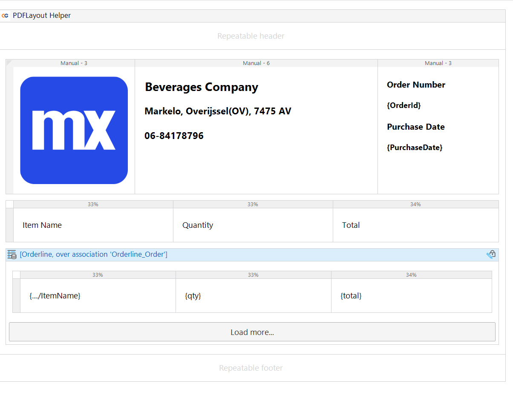
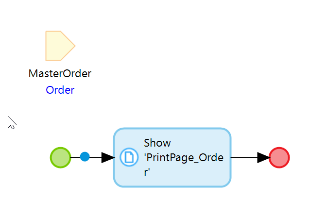
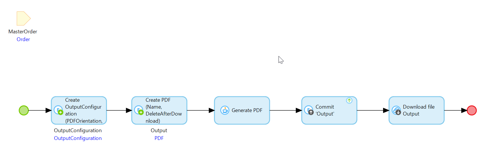
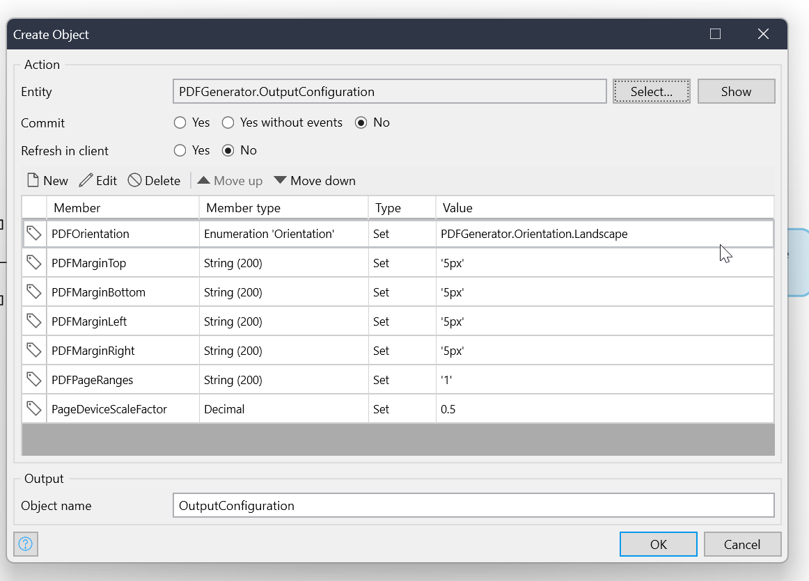

# Setting Up Server-Side PDF Generation

## Overview

Server-side PDF generation offers advanced features and capabilities not available in client-side methods. This guide will walk you through the setup process.

## Prerequisites

If running locally:
- Ensure your Mendix application is accessible from the internet using a tool like ngrok.
- Note the ngrok URL (e.g., https://*.ngrok-free.app) for accessing your application.
- Be aware that this URL changes each time you run ngrok.

## Setup Process

### 1. Configure Constants

Add the following constants to your application:

- `PDFGenerator.ServerURL`: Set to `wss://pdfgenerator.capegroep.nl`
- `PDFGenerator.isLocal`: 
  - Set to `true` if running the application locally on your computer.
  - Set to `false` if your application can be accessed directly from the internet.
- `PDFGenerator.PublicURL`:
  - If `isLocal` is `true`, set this to your ngrok URL.
  - If `isLocal` is `false`, you can leave this empty.

### 2. Create PDF Page

- Create a page that will be printed as PDF.
- Set the page layout to `PDF_Layout`.
- You can have at most 1 parameter for the page.
- Optionally use the PDFLayout Helper widget for headers/footers.

### 3. Create Show Page Microflow

- Create a microflow that takes 1 parameter (specified in the PDF page).
- It should contain a "Show Page" action.
- It should not return anything else.

### 4. Create PDF Call Microflow

Use the GeneratePDF Java action in this microflow. Configure the following parameters:

- `ServerURL`: Use the `PDFGenerator.ServerURL` constant.
- `OpenPageMicroflow`: Name of the microflow that opens the PDF page.
- `OpenPageParameter`: Object to be passed to the PDF Page.
- `User`: Specify which user the page microflow will run as. Ensure this user has correct access rights.
- `OutputConfiguration`: Specify size, DPI, paper type for the generated PDF.
- `Output`: Will contain the PDF output.
- `isLocal`: Use the constant set earlier.
- `PublicURL`: Use the constant set earlier.

### 5. Implement PDF Generation

Use the PDF call microflow as a button action or in a Scheduled event.

## Security Considerations

- All generated data is encrypted using a client-generated symmetric key (AES-GCM-128).
- Data is sent through a secure channel using the WSS protocol.
- PDFs are stored in AWS S3 (eu-central-1 region) with SSE encryption enabled.
- PDFs are encrypted with the aforementioned symmetric key before storage.
- Data is deleted from the server after download or after 1 day if not downloaded.
- The service provider cannot read your PDF content.
- As a precaution, give minimal necessary rights to the PDF User.

## Best Practices
- Thoroughly test the PDF generation process, especially when running locally.
- Carefully manage user permissions for the PDF generation process.

## Troubleshooting

- If PDFs aren't generating, check your internet connectivity and ngrok setup (if applicable).
- Verify that all constants are correctly set.
- Ensure the specified user has the necessary permissions to access all required resources.
- Check mendix logs for any error messages related to the PDF generation process.

